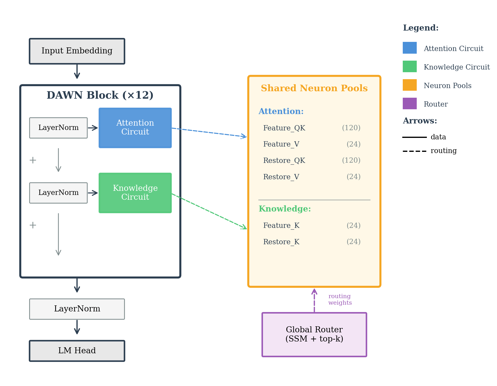

# DAWN: Dynamic Architecture With Neurons

[](https://doi.org/10.5281/zenodo.XXXXXXX)

DAWN replaces static weight matrices with dynamic routing over shared neuron pools, achieving 4× better perplexity than vanilla Transformers with 4.5× fewer parameters.

## Key Results

| Model | Params | PPL ↓ | Acc ↑ |
|-------|--------|-------|-------|
| Vanilla-22M | 22.6M | 53.1 | 31.5% |
| Vanilla-108M | 108.9M | 32.7 | 36.6% |
| **DAWN-24M** | 23.9M | **8.4** | **55.4%** |

*Trained on C4 (5B tokens)*

## Architecture



## Installation

```bash
git clone https://github.com/madst0614/DAWN
cd DAWN
pip install -r requirements.txt
```

## Quick Start

### Inference

```python
import torch
from model import DAWN

# Load model
config = {...}  # see configs/dawn_v17.1.yaml
model = DAWN(**config)
model.load_state_dict(torch.load("dawn_24m_weights.pt"))
model.eval()
```

### Training

```bash
python train.py
```

## Checkpoints

Download pretrained weights from [Zenodo](https://doi.org/10.5281/zenodo.XXXXXXX):

| Model | Params | PPL | Download |
|-------|--------|-----|----------|
| DAWN-24M | 23.9M | 8.4 | [weights](https://doi.org/10.5281/zenodo.XXXXXXX) |

## Citation

```bibtex
@misc{choi2025dawn,
  title={DAWN: Dynamic Architecture With Neurons},
  author={Seungho Choi},
  year={2025},
  howpublished={Zenodo},
  doi={10.5281/zenodo.XXXXXXX}
}
```

## License

MIT
